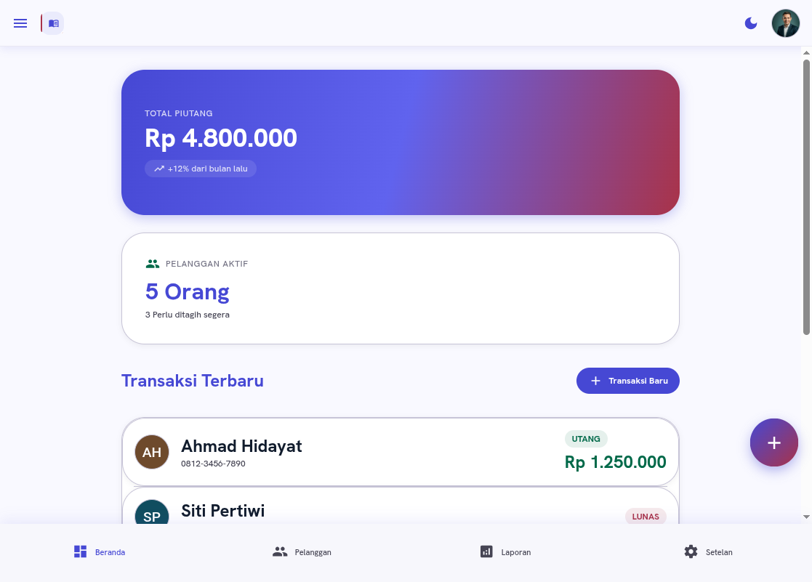

# BukuKios — Buku Besar Digital

<p align="center">
  
</p>

Aplikasi pencatatan keuangan UMKM berbasis React Native (Expo) untuk mengelola piutang dan utang pelanggan. Antarmuka dalam Bahasa Indonesia.

## Fitur

### Manajemen Pelanggan
- Tambah, edit, dan hapus pelanggan
- Pencarian pelanggan berdasarkan nama atau nomor telepon
- Kategori pelanggan: Grosir / Eceran
- Status otomatis: **Aktif** (masih ada utang) atau **Lunas**

### Manajemen Transaksi
- Catat utang baru dengan invoice otomatis
- Catat pembayaran (bayar)
- Edit transaksi — bisa ubah jumlah, deskripsi, tanggal, tipe (utang↔bayar), bahkan pindah pelanggan
- Hapus transaksi — otomatis sesuaikan saldo pelanggan
- Field **jatuh tempo** (opsional) untuk utang
- Badge **OVERDUE** pada transaksi yang melewati jatuh tempo
- Filter transaksi: berdasarkan jenis (utang/bayar) dan rentang waktu
- Pagination riwayat transaksi — tombol "Tampilkan Lebih Banyak"
- Notifikasi jatuh tempo otomatis dibatalkan saat transaksi diedit/dihapus

### Dashboard & Laporan
- Ringkasan total piutang dan jumlah pelanggan perlu ditagih
- Top 5 pelanggan dengan utang terbesar
- Laporan keuangan: total piutang, total dibayar, tren bulanan
- Ranking pelanggan berdasarkan jumlah utang

### Buku Besar (Ledger)
- Tampilan ledger per pelanggan dengan saldo berjalan
- Kolom: Tanggal, Keterangan, Debit (utang), Kredit (bayar), Saldo

### Invoice & Receipt
- Preview invoice dalam bentuk modal untuk setiap transaksi
- Bagikan atau simpan invoice via Share API
- Tombol **Struk** dari menu konteks transaksi

### Data & Backup
- Export data ke **CSV** (semua transaksi)
- Export **Laporan** ringkasan (pelanggan + transaksi)
- Backup data ke **JSON**
- **Restore** dari file backup JSON (paste langsung di app)
- Reset data ke data awal (seed)

### Notifikasi
- Pengingat jatuh tempo: H-3 dan pada hari-H
- Toggle on/off dari Settings

### Tampilan
- **Mode gelap** (dark mode)
- **Drawer navigasi** — slide-out menu dari ikon hamburger
- **ActionSheet** — bottom sheet interaktif (filter, kelola data, reset, konfirmasi)
- **About modal** — info aplikasi dengan versi, developer, tech stack
- **Help modal** — FAQ interaktif dengan panduan penggunaan aplikasi
- Link rating: Play Store (Android) / App Store (iOS)
- Animasi halus dengan Reanimated
- Palet teal-navy + forest green

### Profil & Pengaturan
- Edit nama toko dan email dari halaman Settings
- Profil tersimpan otomatis, tidak hardcode

## Tech Stack

| Kategori | Teknologi |
|---|---|
| Framework | Expo SDK 55 + Expo Router |
| UI | React 19.2 + React Native 0.83.6 |
| Language | TypeScript (strict mode) |
| Navigation | React Navigation (bottom tabs + stack) |
| Animation | Reanimated 4.2 |
| Storage | AsyncStorage v3 |
| Fonts | Hanken Grotesk (headings), Inter (body) |
| Compiler | React Compiler (auto memoization) |

## Struktur Proyek

```
bukukios/
├── screenshots/
├── src/
│   ├── app/                          # Expo Router routes
│   │   ├── _layout.tsx               # Root: fonts, Stack, ThemeProvider
│   │   ├── (tabs)/
│   │   │   ├── index.tsx             # Dashboard
│   │   │   ├── customers/
│   │   │   │   ├── index.tsx         # Daftar pelanggan + search
│   │   │   │   ├── [id].tsx          # Detail pelanggan + transaksi + ledger
│   │   │   │   ├── tambah-pelanggan.tsx
│   │   │   │   └── edit-pelanggan.tsx
│   │   │   ├── reports.tsx           # Laporan keuangan
│   │   │   └── settings.tsx          # Pengaturan
│   │   └── tambah-transaksi.tsx      # Modal form transaksi
│   ├── components/                   # UI components
│   │   ├── SideMenu.tsx             # Slide-out drawer navigasi
│   │   ├── ActionSheet.tsx          # Bottom sheet interaktif
│   │   ├── AboutModal.tsx           # Info aplikasi
│   │   ├── HelpModal.tsx            # FAQ & panduan
│   ├── constants/                    # Theme, animations
│   ├── context/                      # ThemeContext, DrawerContext
│   ├── hooks/                        # Data hooks (useCustomers, etc.)
│   ├── storage/
│   │   ├── database.ts               # AsyncStorage CRUD layer
│   │   └── hooks.ts                  # Reactive data hooks
│   ├── types/                        # TypeScript interfaces
│   └── utils/                        # Utilities (format, export, notifications)
├── app.json                          # Expo config
├── babel.config.js
├── package.json
└── tsconfig.json
```

## Commands

| Command | Deskripsi |
|---|---|
| `npm start` | Jalankan Expo dev server |
| `npm run android` | Run di Android emulator/device |
| `npm run ios` | Run di iOS simulator |
| `npm run web` | Run di browser |
| `npm run lint` | ESLint check |
| `npx tsc --noEmit` | TypeScript type check |

**Urutan verifikasi:** `lint` -> `tsc --noEmit` -> manual test

## Instalasi

```bash
# Clone repository
git clone <repository-url>
cd bukukios

# Install dependencies
npm install

# Start development server
npm start
```

## Arsitektur Data

- **Single data source**: `src/storage/database.ts` — semua operasi CRUD melalui AsyncStorage
- **Keys**: `@bukukios/customers`, `@bukukios/transactions`, `@bukukios/initialized`, `@bukukios/profile`
- **Seed data**: Ditulis saat pertama kali run (dicek via `@bukukios/initialized`)
- **Atomic update**: `saveTransaction()` update transaksi + `totalDebt` customer sekaligus
- **Auto status**: `totalDebt > 0` -> `'aktif'`, `totalDebt === 0` -> `'lunas'`

## Lisensi

MIT
